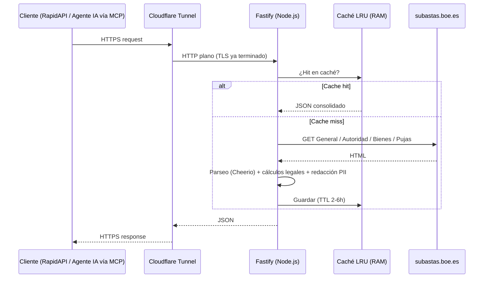

# Subastas BOE API


API REST + servidor MCP que consolida en un único JSON limpio los datos dispersos en las cuatro pestañas (**General**, **Autoridad**, **Bienes**, **Pujas**) del portal oficial de subastas judiciales, notariales y tributarias del Estado español: [subastas.boe.es](https://subastas.boe.es).

Pensada para alimentar agentes de IA (vía [Model Context Protocol](https://modelcontextprotocol.io)), paneles de PropTech y flujos de análisis de inversión inmobiliaria, sin depender de navegadores headless ni de bases de datos pesadas.

## Por qué existe este proyecto

El portal del BOE publica datos públicos de alto valor (tasaciones, depósitos, cargas, pujas) pero los reparte en pestañas independientes por activo, sin una API oficial. Cruzar esa información a mano —y calcular a la vez los umbrales legales de adjudicación directa— es lento y propenso a errores. Esta API hace ese cruce automáticamente y expone el resultado como JSON listo para consumir.

## Restricción de diseño: arquitectura Zero-Disk

El servicio está pensado para correr en un equipo doméstico muy limitado (Intel Core i3 de 3ª generación, 4 GB de RAM, disco duro mecánico, conexión residencial tras CG-NAT). Esa restricción, en lugar de ser una limitación a esconder, es la decisión de diseño central del proyecto:

- **Sin disco**: ninguna petición a la API toca el disco mecánico. Todo el ciclo de vida (fetch → parseo → caché) ocurre en memoria.
- **Sin navegadores headless**: el HTML del BOE es ligero, así que basta con peticiones HTTP asíncronas (`undici`) y parseo con `cheerio`, evitando los cientos de MB que consumiría Puppeteer/Playwright.
- **Caché LRU en RAM** con TTL (2-6 h, acorde al ritmo real de actualización de una subasta) y un *memory-pressure guard* que se autolimpia si el proceso se acerca al límite de memoria disponible.
- **Exposición vía Cloudflare Tunnel**, que resuelve el CG-NAT y descarga la terminación TLS de la CPU del servidor.



## Estado actual del proyecto

Este repositorio se está desarrollando de forma incremental y pública. Estado a fecha de la última actualización:

**Hecho**
- [x] Servidor Fastify con OpenAPI/Swagger, rutas (`/health`, `/provinces`, `/auctions`) y caché en memoria conectada.
- [x] Parseo real del HTML del BOE (búsqueda por POST y detalle multi-pestaña, incluidas subastas multi-lote), verificado en vivo contra `subastas.boe.es`.
- [x] Cálculos legales automáticos (umbrales del 50%/70%, depósito del 5%, con transparencia sobre si se basan en la tasación o en el valor de subasta) y redacción de PII (DNI/NIE/IBAN) para cumplir RGPD.
- [x] Servidor MCP (`src/mcp/`) con 4 *tools*, verificado con un cliente MCP real por stdio.
- [x] 21 tests automatizados (utilidades, parsers contra fixtures reales y servidor MCP).
- [x] Verificación del gateway de RapidAPI (cabecera de proxy) en producción.
- [x] Control de versiones, licencia y documentación legal básica.

**En progreso (ver desglose completo en la sección Roadmap)**
- [ ] Pruebas de memoria/concurrencia en el hardware real de producción.
- [ ] Despliegue en producción (Cloudflare Tunnel + PM2) y CI/CD básico.
- [ ] Publicación en RapidAPI.

## Características principales (objetivo de diseño)

- **Zero-Disk:** todo el scraping, parseo y caché ocurre en RAM.
- **Sin navegadores headless:** parseo eficiente con Cheerio.
- **Multi-tab:** consolida General, Autoridad, Bienes (incluidos lotes múltiples) y Pujas en un solo objeto JSON.
- **MCP:** servidor MCP propio (`npm run mcp`) para que agentes de IA consulten subastas directamente.
- **Cálculos legales automáticos:** umbrales del 50% y 70%, depósito del 5%.
- **Filtrado de PII:** elimina identificadores personales (DNI/NIE/IBAN) para cumplir RGPD.

## Stack técnico

Node.js (ESM) · Fastify · Cheerio · undici · quick-lru · pino · Zod · `@modelcontextprotocol/sdk` · PM2 · Cloudflare Tunnel.

## Requisitos

- Node.js >= 20
- 4 GB RAM (recomendado; es el objetivo de diseño, no un mínimo arbitrario)
- Cloudflare Tunnel para exposición tras CG-NAT
- PM2 (opcional, recomendado para producción)

## Instalación rápida

```bash
npm install
cp .env.example .env
# Edita .env con tu configuración (ver comentarios en el propio archivo)
npm run dev
```

## API REST

| Método | Ruta              | Descripción                                  |
|--------|--------------------|-----------------------------------------------|
| GET    | `/health`          | Estado del servicio.                          |
| GET    | `/provinces`        | Listado de las 52 provincias españolas con su código BOE. |
| GET    | `/auctions`         | Búsqueda de subastas (filtros: provincia, estado, tipo de bien, rango de valor, paginación). |
| GET    | `/auctions/:id`     | Detalle consolidado de una subasta (General + Autoridad + Bienes + Pujas). |

La documentación interactiva (Swagger UI) está disponible en `/docs` una vez el servidor está corriendo.

```bash
curl "http://localhost:3000/auctions?province=28&type=inmuebles&status=celebrandose"
```

Estructura de respuesta real de `/auctions/:id` (ejemplo, contra una subasta real con un único lote):

```json
{
  "id": "SUB-JA-2026-260225",
  "general": {
    "auctionType": "JUDICIAL EN VÍA DE APREMIO",
    "caseAccount": "0730 0000 06 0398 21",
    "startDate": "2026-06-05T18:00:00+02:00",
    "endDate": "2026-06-25T18:00:00+02:00",
    "claimedAmount": 167000.86,
    "auctionValue": 167000.86,
    "appraisalValue": 267000,
    "minimumBid": null,
    "bidIncrement": 3340.01,
    "publishedDeposit": 8350.04,
    "metricsBasedOn": "tasacion",
    "reference70": 186900,
    "reference50": 133500,
    "deposit": 13350,
    "documents": []
  },
  "authority": {
    "code": "0809642002",
    "name": "Sección Civil TI Granollers. Plz.n 2",
    "address": "CL JOSEP UMBERT 124 7 ; 08400 GRANOLLERS",
    "phone": "936934580",
    "email": "sce.granollers@xij.gencat.cat"
  },
  "lots": [
    {
      "idLote": "1",
      "description": "FINCA SITA EN GRANOLLERS ( BARCELONA )",
      "assets": [
        { "label": "Bien 1 - Inmueble (Vivienda)", "address": "...", "locality": "GRANOLLERS", "province": "Barcelona" }
      ]
    }
  ],
  "bids": { "currentMaxBid": null, "secret": false, "totalBids": 0, "requiresDeposit": true, "perLot": [] },
  "metadata": { "sourceUrl": "...", "scrapedAt": "ISO-8601", "cached": false }
}
```

`metricsBasedOn` indica si los umbrales del 50%/70% se calcularon sobre la tasación oficial o, en su defecto, sobre el valor de subasta (el BOE no siempre publica la tasación). En subastas multi-lote, cada elemento de `lots[]` lleva sus propios `auctionValue`/`appraisalValue`/`reference70`/`reference50`/`deposit`, porque el valor económico es por lote y no a nivel de subasta.

## Servidor MCP

```bash
npm run mcp
```

Expone 4 *tools* por transporte stdio, reutilizando la misma capa de caché en RAM que la API REST (`src/services/auctionsService.js`):

| Tool | Descripción |
|------|-------------|
| `search_auctions` | Busca subastas (provincia, estado, tipo de bien, paginación). |
| `get_auction_detail` | Detalle consolidado de una subasta por su id. |
| `calculate_auction_metrics` | Calcula umbrales 50%/70% y depósito a partir de un importe. |
| `list_provinces` | Lista las 52 provincias y su código. |

Configuración para Claude Desktop / Cursor (`claude_desktop_config.json` o equivalente):

```json
{
  "mcpServers": {
    "subastas-boe": {
      "command": "node",
      "args": ["/ruta/absoluta/a/subastas-boe-api/src/mcp/server.js"]
    }
  }
}
```

## Exposición con Cloudflare Tunnel

```bash
cloudflared tunnel --no-autoupdate run --token <TU_TOKEN>
```

Ver [scripts/deploy-cloudflare.sh](scripts/deploy-cloudflare.sh) para el script de despliegue completo (túnel + PM2).

## Estructura del proyecto

```
src/
├── api/
│   ├── middleware/   # logger (pino), errorHandler
│   ├── routes/       # health, provinces, auctions
│   └── server.js     # bootstrap de Fastify + Swagger + verificación del proxy de RapidAPI
├── cache/
│   └── memory.js     # caché LRU en RAM con TTL y memory-pressure guard
├── config/           # env vars, constantes del BOE, planes de precio
├── mcp/
│   ├── server.js     # bootstrap del servidor MCP (fuerza logs a stderr antes de cargar nada más)
│   ├── runtime.js     # construcción de McpServer + transporte stdio
│   └── tools.js       # las 4 tools expuestas a agentes de IA
├── services/
│   └── auctionsService.js  # caché compartida entre la API REST y el MCP
├── scrapers/
│   ├── search.js     # búsqueda real (POST a subastas_ava.php)
│   ├── detail.js     # detalle consolidado real (ver=1/2/3/5, multi-lote)
│   └── utils/        # fetch con reintentos, límite de concurrencia, cálculos legales, redacción PII
└── index.js           # entry point de la API REST
tests/
├── fixtures/          # HTML real descargado de subastas.boe.es
├── parsers.test.js     # utilidades puras
├── scrapers.test.js     # parsers contra los fixtures reales
└── mcp.test.js          # registro y esquemas de las tools del MCP
```

## Roadmap

Proyecto dividido en dos bloques: completar el producto técnico y, después, marketing/SEO/adquisición de clientes para la monetización vía RapidAPI.

**Bloque 1 — Producto técnico**
1. ~~Mapeo de selectores reales sobre los fixtures HTML descargados.~~ ✅
2. ~~Parseo real en `search.js` y `detail.js` + límite de concurrencia hacia el BOE.~~ ✅
3. ~~Tests de parseo contra los fixtures reales.~~ ✅
4. ~~Servidor MCP en `src/mcp/`.~~ ✅
5. Pruebas de memoria/concurrencia en el hardware real (HP Pavilion 15 / Debian 13) y hardening de errores.
6. Despliegue en producción (Cloudflare Tunnel + PM2) y CI/CD básico.

**Bloque 2 — Monetización**
7. Publicación en RapidAPI con los planes Free / Starter / Pro / Business.
8. Ficha optimizada para SEO, landing propia, presencia en directorios de servidores MCP y comunidades del sector inmobiliario/PropTech.

## Legal

- Los datos provienen del portal oficial del BOE y están sujetos a sus condiciones de reutilización de información pública. Esta API no sustituye la consulta directa en `subastas.boe.es` ni constituye asesoramiento legal o de inversión.
- Ver [docs/PRIVACY.md](docs/PRIVACY.md) y [docs/TERMS.md](docs/TERMS.md) para el tratamiento de datos personales y los términos de uso del servicio.

## Licencia

Código fuente disponible bajo **[PolyForm Noncommercial License 1.0.0](LICENSE)**: puedes leerlo, estudiarlo y usarlo con fines no comerciales (educativos, de investigación, portfolio). El uso comercial del código —incluido desplegar una instancia propia del servicio— no está permitido sin autorización expresa del autor. El servicio en sí se ofrece comercialmente a través de RapidAPI.
